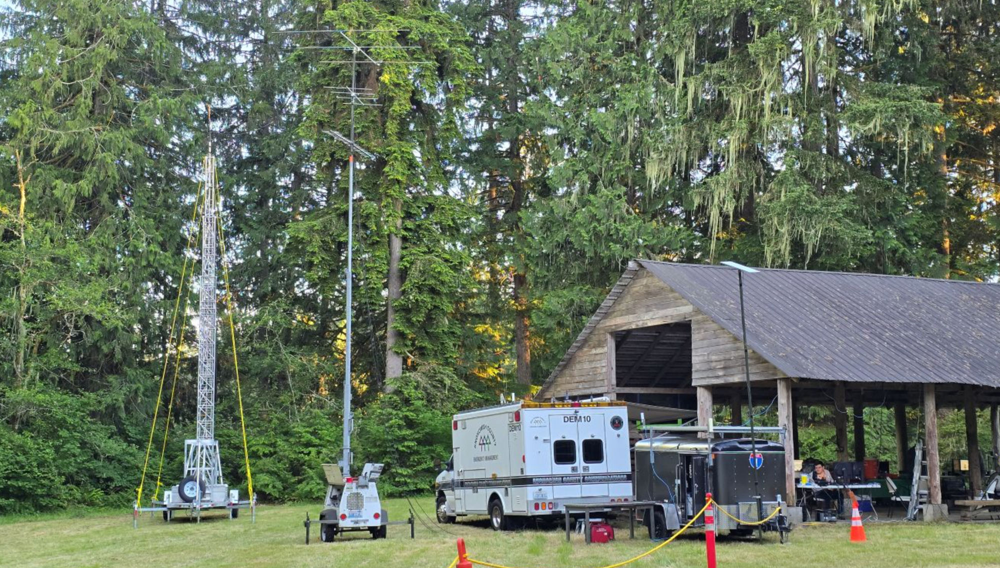
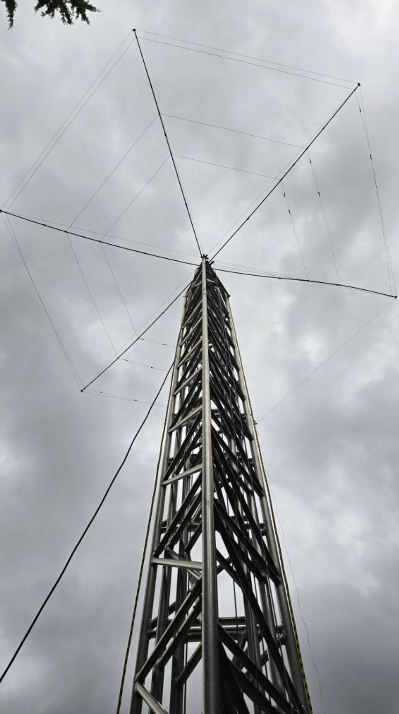

MicroHAMS operated ARRL Field Day 2026 as **N7OS** from Camp Freeman near Monroe, finishing with **449 logged contacts** and a **preliminary score of 2,224**. Twenty-five participants ran a 3A station on generator, battery, and solar power across the June 27–28 weekend. Contact totals were up over 2025 in every mode, and the club is already lining up new ways to add to the score in 2027.

_The VHF station, comms van, and mast trailers set up beside the Camp Freeman pavilion._

## The numbers

Contacts earned **627 points** before the power multiplier — 133 on CW, 45 digital, and 271 phone. Running entirely on emergency power qualified N7OS for the 2X multiplier, doubling that to **1,254**. Add **970 bonus points** and the preliminary total comes to **2,224**.

| Band      |      CW | Digital |   Phone |
| :-------- | ------: | ------: | ------: |
| 80m       |       — |       — |      39 |
| 40m       |      70 |      45 |      18 |
| 20m       |       — |       — |     143 |
| 15m       |      62 |       — |      53 |
| 10m       |       — |       — |       1 |
| 6m        |       1 |       — |       9 |
| 2m        |       — |       — |       8 |
| **Total** | **133** |  **45** | **271** |

Twenty meters carried the phone effort with 143 contacts, the single busiest band of the weekend. Forty meters did the heavy lifting on CW and digital, accounting for all 45 digital contacts and half the CW total. Fifteen meters came back strong for both CW and phone, and the VHF stations added contacts on 6m and 2m.

The 970 bonus points came from a spread of activities: 300 for running 100% on emergency power, plus 100 each for a public location, a public information table, copying the W1AW Field Day bulletin, completing natural-power contacts, a site visit by an invited served agency, and a safety officer. Youth participation added 20 and the web entry another 50.

## Up across the board

The story of 2026 is a busier station. "When I compare the data to last year, we increased our numbers in almost every way," said club secretary Grant Hopper, KB7WSD. "We had more QSOs overall, and more in every mode."

Band conditions moved the contacts around. More of the action landed on 80 and 15 meters than in past years, which Hopper read as a sign that more people spent more time at the radios. "That sounds like a good thing to me," he said.

## Looking ahead to 2027

With contact numbers already up across the board, the clearest path to a bigger score next year runs through the bonus categories — each one a set piece the club can plan for and hand to a volunteer who wants to own it.

> **Open bonus opportunities for 2027**
>
> - **Message handling** — pass formal NTS traffic during the event
> - **Publicity** — a public-information effort and outreach to local media
> - **Satellite contact** — work a pass for the bonus
> - **Educational activity** — run a demonstration or class on site
> - **Served-agency or official visit** — host a guest from a partner agency or local government

Each of these is worth 100 points, and most come down to lining someone up ahead of the weekend. The official visit, in particular, is more approachable than it sounds: the rules don't specify what kind of official, so a commissioner from the water district or a similar local office is a realistic ask for 2027.

The stations themselves performed well, and there's room to sharpen them too. With three HF transmitters and a VHF station running at once, some signals found their way between radios. "To be sure, they did work very well, but we had some 'edge case' issues that we can probably engineer around for 2027," Hopper said. A closer look at the filtering and antenna spacing is on the list for the next planning cycle.

_The BuddiHex on its tower trailer carried the HF stations across 20, 15, and 10 meters._

## Thanks

"Thank you to everyone that helped and also to everyone that got on the air and contributed to the QSO numbers," Hopper said.

The club will go through the results in person at the **[July meeting](/events/2026-07-july-meeting)** on July 21, and members are invited to bring their own Field Day stories.
