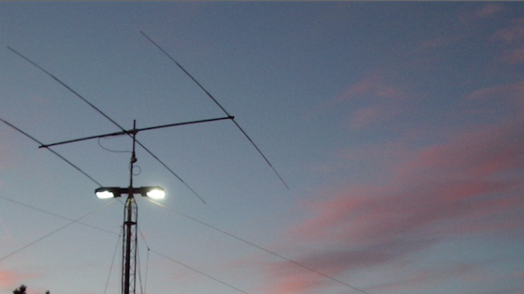
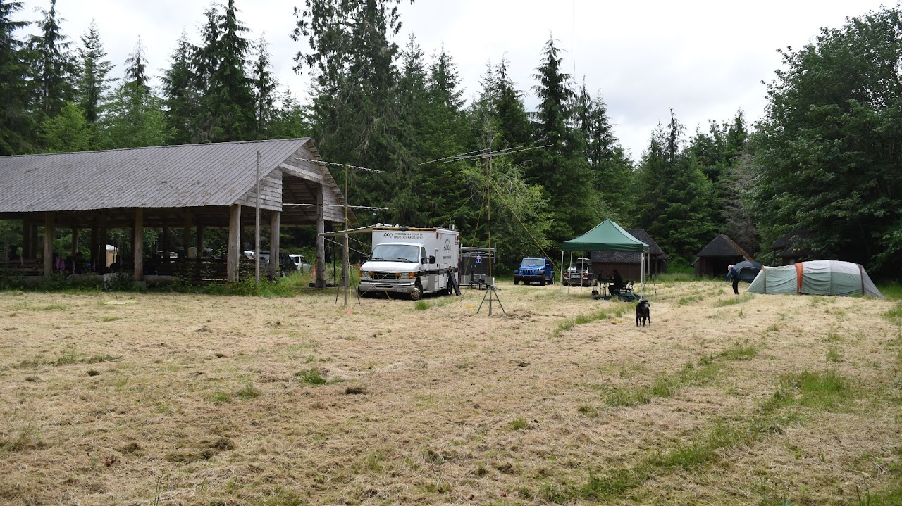
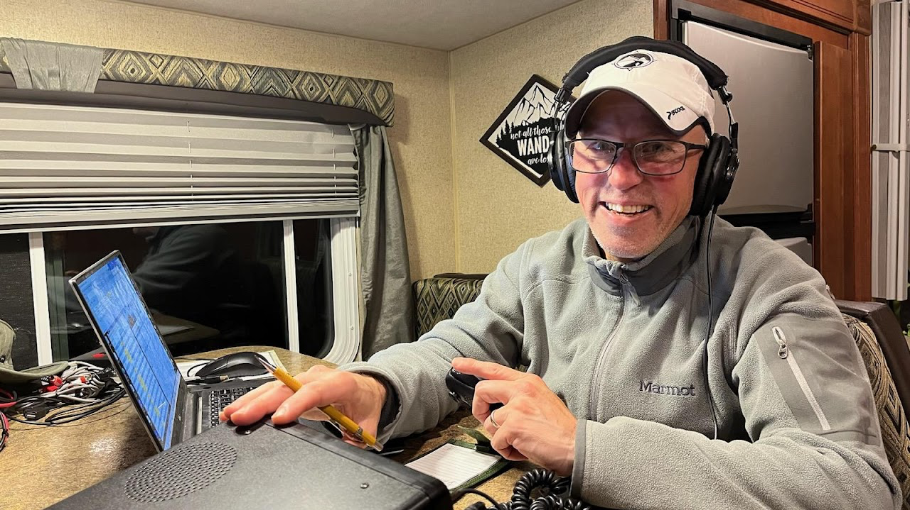

Field Day is the one weekend a year the whole club shows up to build a working station from nothing — antennas in the trees, radios on battery and solar, and twenty-four hours of operating away from the grid. MicroHAMS has been doing it, in one form or another, since the club formed in **1999**.

## A tradition since 1999

Since our formation in 1999, MicroHAMS has put on many Field Day efforts — some large, some small. Past sites read like a tour of the east side: the rooftop level of the **building 40/41 parking garage**, the old **campus recycling area**, and **Farrel-McWhirter Park** in Redmond. The scale changed from year to year, but the point never did: get on the air, together.

_Tribander at sunset at 40/41 garage._

## Field Day 2025

In 2025, the Snohomish ACS team provided additional assistance with setup and operating. The antenna configuration was simplified to a **Buddihex** antenna for 20m, 15m, and 10m with a triplexer and bandpass filters feeding the three **Icom IC-7300** HF radios. Dipoles were available for 40m and 80m at night.

We operated under the call **W7FLY** — 3A plus VHF (6m, 2m, and 70cm) with a vertical and two wire dipoles up at 62 and 80-plus feet. We had a great time and great weather (it was "too hot" on Friday, but we all had fun!). Plenty of space for on-site camping, great food, and really good band conditions for the entire 24 hours.

_2024 Field Day VHF station at Camp Freeman._

## The 2026 station

For 2026 the club operates as **N7OS** and returns to **3A class** with **three HF stations and a VHF+ station**. The plan calls for the Buddihex back up on a **72-foot telescoping tower trailer**, again with the triplexer and bandpass filters, plus a single low-band dipole shared between 40m and 80m using a **duplexer and bandpass filters** to keep the two bands apart. The Icom radios return, along with the [MITRU](https://snohomishcountywa.gov/6417/MITRU-Program) and the communications van for VHF+.

_Expected 2026 site layout._

The plan threads three HF stations off the BuddiHex and a shared 80m/40m dipole, with the VHF+ station and its Yagis on the mast trailer alongside the [MITRU](https://snohomishcountywa.gov/6417/MITRU-Program) and the communications van. Each station runs an Icom IC-7300 — a 7300/9700 pairing for VHF+ — with dual-monitor PCs and the N3FJP logger. Parking and a visitor information table sit toward the entrance, with camping around the north, south, and east perimeter.

[Come join us in 2026 at Camp Freeman, near Lake Roesiger](/events/2026-06-arrl-field-day) — setup on **Friday, June 26**, operating and teardown across **June 27–28**.

## Come join us for fun on the air!

Check out the club's other Field Day pages for more about this year's effort, how to find us, and more. We really do look forward to you joining us for another fun Field Day!

→ The full story, site layout, and directions: [the MicroHAMS Field Day site](https://sites.google.com/view/microhams-field-day/home)

→ Event details, directions, and how to help: [ARRL Field Day 2026](/events/2026-06-arrl-field-day)

→ Get in on the planning: [the MicroHAMS Field Day group](https://groups.google.com/g/microhamsfd)
